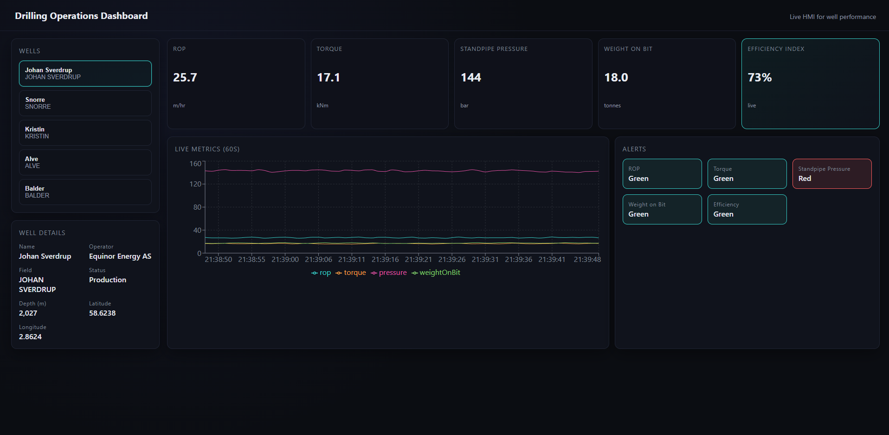
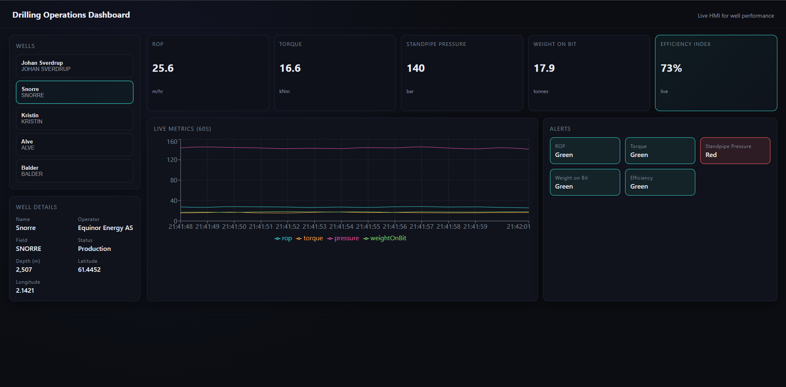
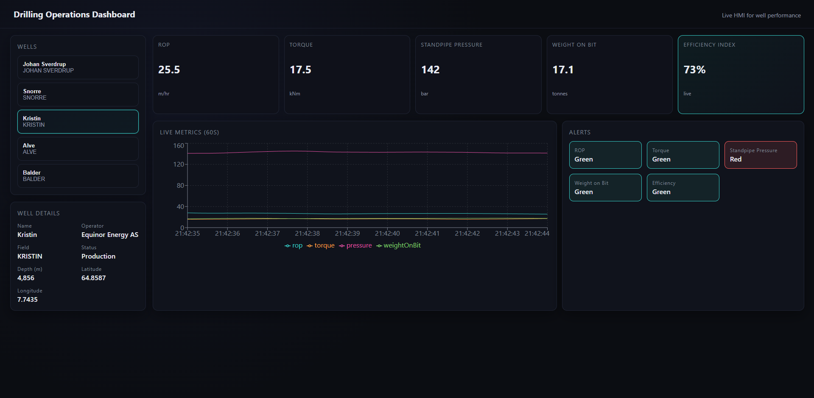
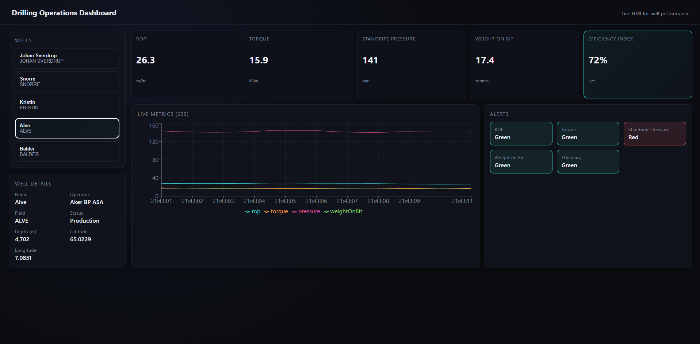
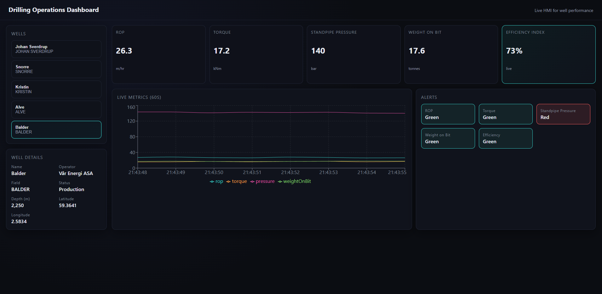

# Drilling Operations Digital Dashboard

HMI-style drilling dashboard demo. Uses sample Norwegian well metadata (Johan Sverdrup, Snorre, Kristin, Alve, Balder) and completely simulated live drilling metrics. Built with GraphQL, WebSockets, React, and TypeScript to demonstrate real-time streaming architecture.


## Overview

This project demonstrates a modern, production-ready architecture for industrial HMI (Human-Machine Interface) applications. It simulates a real-time drilling operations monitoring system with live sensor data visualization, alert management, and well selection capabilities.

While the drilling metrics are simulated, the architecture patterns, technology stack, and implementation approach mirror real-world industrial monitoring systems used in oil & gas, manufacturing, and process control environments.

## Features

- **Real-time Data Streaming**: Live drilling metrics updated every second via WebSocket subscriptions
- **Multi-Well Monitoring**: Switch between 5 Norwegian Continental Shelf wells instantly
- **Live Metrics Visualization**: 
  - Rate of Penetration (ROP) - m/hr
  - Torque - kNm
  - Standpipe Pressure - bar
  - Weight on Bit - tonnes
  - Efficiency Index - calculated live metric
- **Time-Series Charts**: 60-second rolling window with smooth updates
- **Alert System**: Threshold-based color indicators (Green/Yellow/Red)
- **Well Details Panel**: Operator, field, depth, coordinates
- **Dark HMI Theme**: High-contrast, industrial-grade UI

## Technology Stack

### Backend

| Technology | Purpose | How It's Used |
|------------|---------|---------------|
| **Node.js** | Runtime | JavaScript runtime for backend services |
| **TypeScript** | Language | Type-safe code throughout backend |
| **Apollo Server** | GraphQL Server | Exposes queries and subscriptions over HTTP/WebSocket |
| **GraphQL** | API Layer | Single endpoint for all data operations (queries + subscriptions) |
| **GraphQL Subscriptions** | Real-time Events | Pub/Sub pattern for streaming live metrics to clients |
| **graphql-ws** | WebSocket Protocol | WebSocket transport for GraphQL subscriptions |
| **ws** | WebSocket Library | Low-level WebSocket server implementation |
| **Express** | HTTP Server | Serves GraphQL endpoint and handles middleware |

**How the backend works:**
- `WellsDataSource` loads Norwegian well data from JSON file
- `MetricsEngine` generates realistic drilling metrics every second using random walk algorithms
- Metrics are published to a PubSub channel (`DRILLING_METRICS`)
- GraphQL subscription resolvers filter events by `wellId` and stream to connected clients
- WebSocket server runs alongside HTTP server on the same port (`/graphql` path)

### Frontend

| Technology | Purpose | How It's Used |
|------------|---------|---------------|
| **React 18** | UI Framework | Component-based UI with hooks |
| **TypeScript** | Language | Type-safe React components and hooks |
| **Vite** | Build Tool | Fast dev server and optimized production builds |
| **Apollo Client** | GraphQL Client | Queries, subscriptions, and caching |
| **@apollo/client** | State Management | Integrated GraphQL state with React |
| **GraphQL Code Generator** | Type Generation | Auto-generates TypeScript types from GraphQL schema |

**How the frontend works:**
- Apollo Client connects via HTTP for queries and WebSocket for subscriptions
- `useQuery` hook fetches well list on mount
- `useSubscription` hook subscribes to live metrics for selected well
- `useDrillingMetrics` custom hook maintains a 60-second rolling buffer
- Components re-render automatically when new metrics arrive via WebSocket
- Chart updates smoothly without flickering using data buffering strategy

### Visualization

| Technology | Purpose | How It's Used |
|------------|---------|---------------|
| **Recharts** | Charting Library | Time-series line charts with multiple metrics |
| **CSS Grid/Flexbox** | Layout | Responsive dashboard layout |
| **CSS Variables** | Theming | Consistent dark HMI color scheme |

## Architecture

```
┌─────────────────────────────────────────────────────────────┐
│                         Frontend                             │
│  ┌──────────────┐  ┌──────────────┐  ┌──────────────┐      │
│  │  Well List   │  │ Metrics KPIs │  │  Live Chart  │      │
│  │  Component   │  │  Component   │  │  Component   │      │
│  └──────┬───────┘  └──────┬───────┘  └──────┬───────┘      │
│         │                 │                  │               │
│         └─────────────────┴──────────────────┘               │
│                           │                                  │
│                  ┌────────▼────────┐                         │
│                  │  Apollo Client  │                         │
│                  │  (HTTP + WS)    │                         │
│                  └────────┬────────┘                         │
└───────────────────────────┼──────────────────────────────────┘
                            │
                ┌───────────┴───────────┐
                │   GraphQL Endpoint    │
                │   /graphql (4000)     │
                └───────────┬───────────┘
                            │
┌───────────────────────────┼──────────────────────────────────┐
│                      Backend                                  │
│                           │                                  │
│         ┌─────────────────┴─────────────────┐                │
│         │                                   │                │
│  ┌──────▼───────┐                  ┌────────▼────────┐       │
│  │   Queries    │                  │  Subscriptions  │       │
│  │  (wells)     │                  │ (drillingMetrics)│      │
│  └──────┬───────┘                  └────────┬────────┘       │
│         │                                   │                │
│  ┌──────▼───────────┐              ┌────────▼────────┐       │
│  │ WellsDataSource  │              │     PubSub      │       │
│  │  (wells.json)    │              │   (in-memory)   │       │
│  └──────────────────┘              └────────▲────────┘       │
│                                              │                │
│                                     ┌────────┴────────┐       │
│                                     │ MetricsEngine   │       │
│                                     │ (1s intervals)  │       │
│                                     └─────────────────┘       │
└─────────────────────────────────────────────────────────────┘
```

## Project Structure

```
Drilling-Operations-Digital-Dashboard/
├── backend/
│   ├── src/
│   │   ├── datasources/
│   │   │   └── wells.ts              # Loads well data from JSON
│   │   ├── resolvers/
│   │   │   └── index.ts              # GraphQL query/subscription resolvers
│   │   ├── schema/
│   │   │   └── typeDefs.ts           # GraphQL schema definitions
│   │   ├── simulation/
│   │   │   └── metricsEngine.ts      # Generates simulated drilling metrics
│   │   ├── types.ts                  # TypeScript interfaces
│   │   └── server.ts                 # Apollo Server + WebSocket setup
│   ├── data/
│   │   └── wells.json                # Norwegian well metadata
│   ├── package.json
│   ├── tsconfig.json
│   └── Dockerfile
│
├── frontend/
│   ├── src/
│   │   ├── components/
│   │   │   ├── WellList.tsx          # Well selection sidebar
│   │   │   ├── WellDetails.tsx       # Well metadata display
│   │   │   ├── MetricsCards.tsx      # KPI cards (ROP, Torque, etc.)
│   │   │   ├── MetricsChart.tsx      # Time-series line chart
│   │   │   └── AlertPanel.tsx        # Threshold-based alerts
│   │   ├── graphql/
│   │   │   ├── client.ts             # Apollo Client config (HTTP + WS)
│   │   │   └── queries.ts            # GraphQL queries & subscriptions
│   │   ├── hooks/
│   │   │   └── useDrillingMetrics.ts # Custom hook for live metrics
│   │   ├── pages/
│   │   │   └── Dashboard.tsx         # Main dashboard layout
│   │   ├── types.ts                  # TypeScript interfaces
│   │   ├── index.css                 # Dark HMI theme styles
│   │   ├── App.tsx
│   │   └── main.tsx
│   ├── package.json
│   ├── tsconfig.json
│   ├── vite.config.ts
│   └── Dockerfile
│
├── docker-compose.yml
├── .gitignore
└── README.md
```

## Getting Started

### Prerequisites

- **Node.js** 18+ and npm
- **Git** (for version control)
- **(Optional) Docker Desktop** for containerized deployment

### Local Development Setup

#### 1. Clone the Repository

```bash
git clone https://github.com/A-Qadeer542/Drilling-Operations-Digital-Dashboard.git
cd Drilling-Operations-Digital-Dashboard
```

#### 2. Backend Setup

```bash
cd backend
npm install
npm run dev
```

Backend GraphQL server starts at: **http://localhost:4000/graphql**

#### 3. Frontend Setup (New Terminal)

```bash
cd frontend
npm install
npm run dev
```

Frontend dashboard starts at: **http://localhost:5173**

#### 4. Open in Browser

Navigate to **http://localhost:5173** and select a well from the sidebar to see live metrics streaming.

### Docker Deployment

```bash
docker compose up --build
```

- Backend: http://localhost:4000/graphql
- Frontend: http://localhost:4173

## Screenshots

### Johan Sverdrup Well

*Norway's largest oil field - Equinor Energy AS operator*

### Snorre Well

*Depth: 2,507m - Equinor Energy AS operator*

### Kristin Well

*Deep water well at 4,856m - Equinor Energy AS operator*

### Alve Well

*Depth: 4,702m - Aker BP ASA operator*

### Balder Well

*Depth: 2,250m - Vår Energi ASA operator*

## How It Works

### Data Flow: Well Selection
1. User clicks a well in the sidebar
2. React state updates with new `wellId`
3. Old subscription is torn down
4. New subscription connects with `wellId` variable
5. Backend filters PubSub events by `wellId`
6. Only matching metrics are streamed to client

### Data Flow: Live Metrics
1. `MetricsEngine` generates new metrics every 1000ms
2. Publishes to PubSub channel: `DRILLING_METRICS`
3. GraphQL subscription resolver receives event
4. Filters by `wellId` variable
5. Sends metric over WebSocket to subscribed client
6. Apollo Client updates cache
7. React component re-renders with new data
8. Chart adds new point, drops points older than 60s

### Alert Logic
```typescript
ROP:      < 15 m/hr          → Yellow
          < 10 m/hr          → Red

Torque:   > 25 kNm           → Yellow
          > 30 kNm           → Red

Pressure: > 300 bar          → Yellow
          > 320 bar          → Red

Weight:   > 30 tonnes        → Yellow
          > 35 tonnes        → Red

Efficiency: < 50%            → Yellow
            < 40%            → Red
```

## GraphQL API

### Queries

```graphql
query GetWells {
  wells {
    id
    name
    depth
    operator
    field
    latitude
    longitude
    status
  }
}

query GetWell($id: ID!) {
  well(id: $id) {
    id
    name
    operator
    field
  }
}
```

### Subscriptions

```graphql
subscription DrillingMetrics($wellId: ID!) {
  drillingMetrics(wellId: $wellId) {
    rop
    torque
    pressure
    weightOnBit
    efficiencyIndex
    timestamp
    wellId
  }
}
```

## Design Decisions

### Why GraphQL?
- Single endpoint for queries and subscriptions
- Strong typing with schema
- Client-driven data fetching
- Built-in subscription support

### Why WebSockets?
- Real-time, bidirectional communication
- Push-based updates (no polling)
- Low latency for live metrics
- Industry standard for streaming data

### Why Apollo?
- Mature GraphQL ecosystem
- Integrated caching
- Automatic re-rendering
- WebSocket support via `graphql-ws`

### Why TypeScript?
- Type safety across frontend/backend
- Catches errors at compile time
- Better IDE support
- Self-documenting code

### Why Vite?
- Instant hot module replacement (HMR)
- Fast cold starts
- Optimized production builds
- Native ESM support

## Configuration

### Backend Environment Variables

```bash
PORT=4000  # GraphQL server port
```

### Frontend Environment Variables

```bash
VITE_GRAPHQL_HTTP=http://localhost:4000/graphql
VITE_GRAPHQL_WS=ws://localhost:4000/graphql
```

## Build for Production

### Backend
```bash
cd backend
npm run build
npm start
```

### Frontend
```bash
cd frontend
npm run build
npm run preview
```

## Deployment

The application is containerized and ready for deployment to:
- **AWS ECS/EKS**
- **Google Cloud Run**
- **Azure Container Instances**
- **DigitalOcean App Platform**
- **Heroku**

Docker Compose configuration is production-ready with proper networking between services.

## Future Enhancements

- [ ] Add authentication (JWT tokens)
- [ ] Persist metrics to PostgreSQL/TimescaleDB
- [ ] Add historical data playback
- [ ] Multi-user support with role-based access
- [ ] Export metrics to CSV/Excel
- [ ] Add more chart types (bar, gauge, heatmap)
- [ ] Implement alarming with notifications
- [ ] Add drill string visualization
- [ ] Mobile-responsive layout
- [ ] Integrate with real OPC UA / Modbus datasources

## Contributing

Contributions are welcome! Please follow these steps:

1. Fork the repository
2. Create a feature branch (`git checkout -b feature/amazing-feature`)
3. Commit your changes (`git commit -m 'Add amazing feature'`)
4. Push to the branch (`git push origin feature/amazing-feature`)
5. Open a Pull Request

## License

This project is open source and available under the MIT License.

## Author

**Abdul Qadeer**
- GitHub: [@A-Qadeer542](https://github.com/A-Qadeer542)

## Acknowledgments

- Norwegian Petroleum Directorate (NPD) for well data reference
- Equinor, Aker BP, and Vår Energi for operator information
- Apollo GraphQL team for excellent documentation
- React and TypeScript communities

---

**Note**: This is a demonstration project. All drilling metrics are simulated. Well metadata is based on public Norwegian Continental Shelf data but stored locally. No real-time connections to drilling systems are made.
